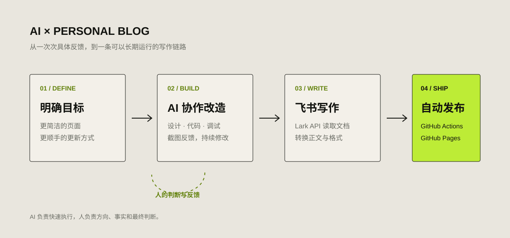

# 我如何用 AI 改造个人 Blog

我没有让 AI 凭空生成一个网站，而是让它进入真实项目，和我一起完成设计、开发、调试与发布。

## 为什么要改

这个 Blog 最早使用 Hugo 主题搭建。能用，但一直有两个问题：页面信息有些杂乱；每次更新都要写 Markdown、整理格式、提交 GitHub，久而久之，写作本身反而成了最麻烦的一步。

我的目标其实很简单：页面更像我自己的空间，而不是一个套用的主题；文章继续保存在 GitHub；平时直接在飞书写，写完后可以同步发布。

这次我没有重新学习一套前端框架，而是把整个项目交给 AI 协作改造。

## AI 实际做了什么

第一步是改页面。

我不断截图、指出哪里不好看：标题不统一、间距不舒服、首页表达不准确、文章摘要和正文重复。AI 直接修改 HTML、CSS 和生成脚本，我刷新预览后继续反馈。页面不是一次“生成”出来的，而是在很多轮具体修改中慢慢确定的。

第二步是整理内容。

原来的文章年代跨度很大，分类和格式也不完全一致。AI 写了一个全站生成脚本，把 Markdown 重新生成成统一的文章页、归档页和主题页，同时保留原始内容。后来新增“个人成长”和“进击的 AI”，也只需要调整生成规则。

第三步是打通飞书。

我习惯在飞书写文档，于是让 AI 接入 Lark API：读取 Wiki 文档，识别标题、正文、列表和引用，再转换成 Blog 使用的 Markdown。这个过程并不顺利，先后遇到密钥、Wiki 权限、文档权限和接口参数问题。AI 读取 GitHub Actions 日志，我负责在 Lark 后台授权，我们一层层把错误排掉。

第四步是自动发布。

现在，飞书文档更新后，我只需要手动运行一次 GitHub Actions。它会读取最新内容、重新生成网站、提交代码，并通过 GitHub Pages 发布。每日反思也可以按照固定时间自动同步。

## 现在的写作流程

目前整条链路已经很短：

1. 在飞书写文章；
2. 标注分类、摘要等信息；
3. 运行 GitHub Actions；
4. 等待 Blog 自动更新。

写作回到了飞书，Markdown、构建和发布交给系统处理。对我来说，这比“AI 帮我写一段代码”更有意义，因为它真正减少了长期维护 Blog 的阻力。

## AI 没有替我做什么

AI 可以改代码、查日志、生成页面，但它不知道什么才像“我的 Blog”。页面应该保留什么、文字是否准确、哪些内容适合公开，仍然需要我决定。

这次最有效的协作方式也不是写一个复杂 Prompt，而是不断给出具体反馈：这里太大、这段重复、这个主题不准确、这次运行失败了。AI 负责快速执行，我负责判断结果。

所以，这次改造带给我最直接的感受是：AI 最适合处理那些“知道想要什么，但实现过程很繁琐”的事情。

它没有替我完成表达，而是帮我把写作、整理和发布连接成了一套真正能长期使用的系统。
