# 从《奥德赛》想到的：成长、责任与回归

今天看了电影《奥德赛》。它当然是一部足够壮阔的电影：战争、海洋、怪物、神明与人的命运，都被放进了一段漫长的归途。但走出电影院后，我记住的并不只是那些奇观，而是一个很朴素的问题：一个男人究竟要经历什么，才算真正成熟？

以下会谈到电影和原作的主要情节。

## 这不是一次出征，而是一次回家

克里斯托弗·诺兰的《奥德赛》改编自荷马史诗，由马特·达蒙饰演奥德修斯，安妮·海瑟薇饰演珀涅罗珀，汤姆·赫兰德饰演他们的儿子忒勒马科斯。官方把它定义为一部使用新一代 IMAX 胶片技术、跨越多地拍摄的“神话动作史诗”。这些信息很容易让人先注意到它的规模，但这个故事最重要的方向，其实不是“向外征服”，而是“向内返回”。

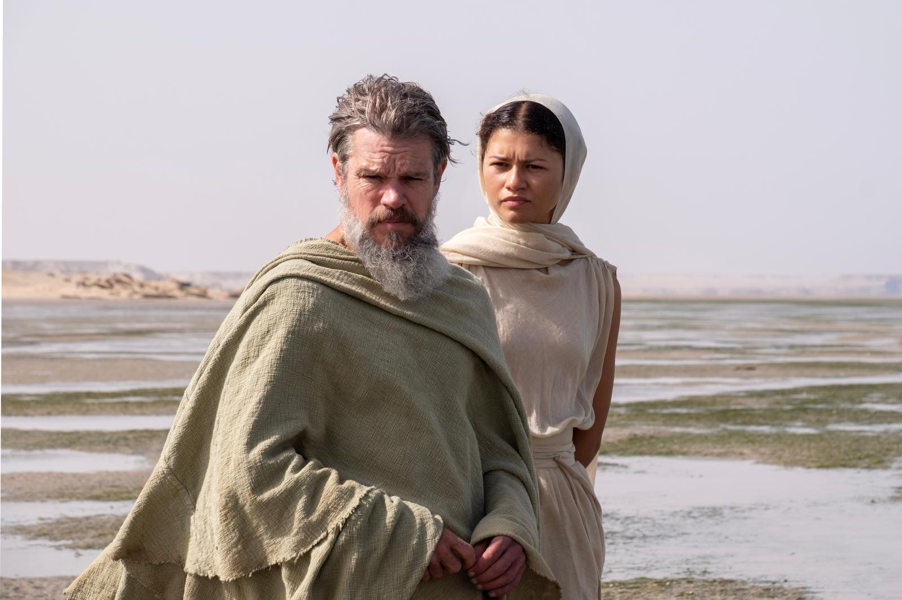

*奥德修斯与雅典娜。电影剧照：Universal Pictures，经 [TIME](https://time.com/article/2026/07/15/the-odyssey-review-christopher-nolan/) 发布。*

特洛伊战争结束后，奥德修斯本应回到故乡伊萨卡。那原本只是一段航程，却变成了十年的漂泊。他遇到独眼巨人、女巫喀耳刻和塞壬，也不断失去同伴。与此同时，珀涅罗珀留在家中抵挡求婚者，忒勒马科斯则在一个父亲长期缺席的家庭里长大，并开始寻找父亲的下落。

所以《奥德赛》其实有三条同时发生的成长线：一个父亲学习如何回来；一个妻子用等待和智慧守住家庭；一个儿子在父亲缺席时开始成为自己。

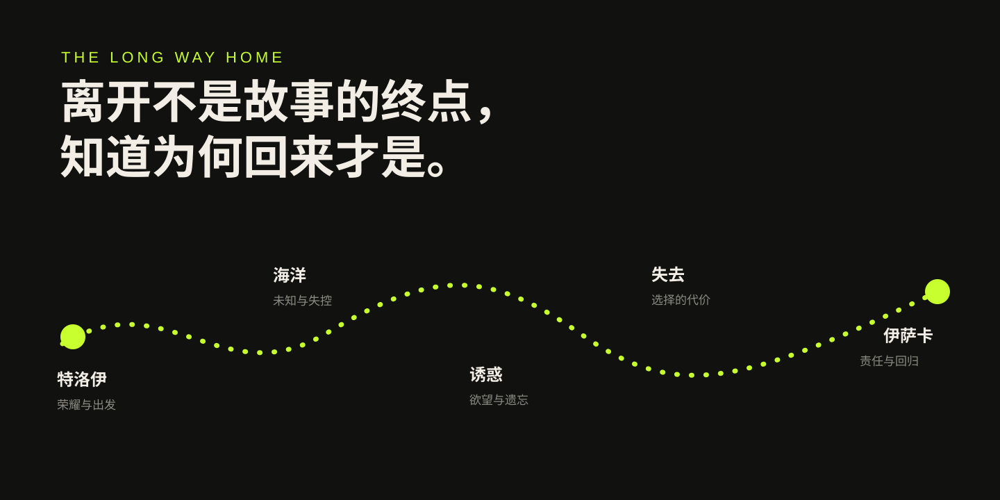

*我根据电影与原作主题整理的概念图，并非地理路线。*

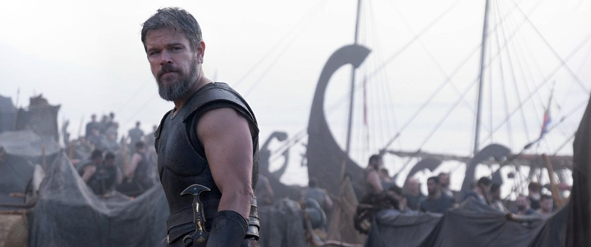

*海上的奥德修斯。电影宣传剧照：Universal Pictures，经 [Lido Cinemas](https://www.lidocinemas.com.au/movies/the-odyssey) 发布。*

## 第一阶段：特洛伊——聪明带来胜利，也留下道德的伤口

电影没有把特洛伊战争只当作一段英雄履历。木马计让希腊人赢得战争，也让奥德修斯成为传说中的智者。但镜头不断回到城破后的杀戮，让这场胜利越来越不像一件值得歌颂的事。

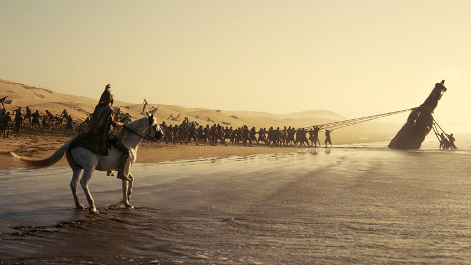

*木马被拖上海滩。电影剧照：Universal Pictures，经 [Looper](https://www.looper.com/2217700/the-odyssey-twist-christopher-nolan-storytelling-trick/) 发布。*

这也是电影理解奥德修斯的起点：他不是一个完成任务后意气风发回家的英雄，而是一个带着战争记忆离开的人。他用智慧突破规则，同时也要面对突破规则以后释放出来的暴力。

**困境**是如何结束一场持续十年的战争；**他的办法**是木马计；**得到的**是胜利和名声；**付出的**却是以后很长时间都无法摆脱的愧疚。电影中的归途因此不只是地理上的回家，也像是一场迟来的道德清算。

这让我想到，聪明并不自动等于正确。一个人可以非常擅长解决问题，却没有认真想过这个解法会让谁承担代价。能力越强，越需要知道什么事情不应该做——否则聪明只是把后果推得更远、更大。

## 第二阶段：独眼巨人——会解决问题，还不等于会领导别人

独眼巨人的段落是整部电影最有压迫感的部分之一。幽暗洞穴、火光和巨大的身体，让奥德修斯与同伴显得非常渺小。过去在战场上有组织、有武器的士兵，突然变成随时可能被吞食的猎物。

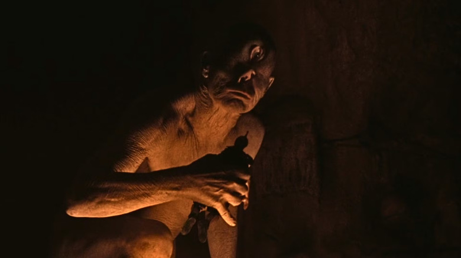

*独眼巨人波吕斐摩斯。电影剧照：Universal Pictures，经 [Looper](https://www.looper.com/2216139/christopher-nolan-the-odyssey-story-accuracy-explained/) 发布。*

这个画面几乎没有传统奇幻电影的华丽感。巨人的身体大部分藏在黑暗里，观众和士兵一样，只能通过局部轮廓判断危险。火光没有带来安全，反而让每一次移动都暴露在巨人的视线中。洞穴也因此不只是一处关押人的空间，更像奥德修斯第一次真正失去控制的地方。

奥德修斯最后依靠观察、协作与冒险，带人刺瞎巨人并逃出去。这里展现了他的核心能力：在所有人陷入恐惧时，他仍然能够思考。

电影还删减了原作中著名的“无人”双关计谋，让逃生显得更直接、更粗粝。这种改动减少了奥德修斯作为语言天才的光环，却强化了现场的混乱：他不是从容操纵一切的智者，而是一个在同伴不断被吞食时勉强找到出口的人。

但这个阶段也暴露了他的局限。他可以想出逃生方案，却无法保证所有人安全离开。每一次成功都混着同伴的死亡，而英雄故事往往只留下“奥德修斯战胜独眼巨人”，不会留下那些没有回来的人。

**困境**是纯粹力量无法战胜的敌人；**克服方式**是冷静、计谋和合作；**收获**是他确认智慧比蛮力更有用；**反思**则是，领导力不能只看最后有没有赢，还要看为了这场胜利牺牲了谁。

工作和生活里也有类似时刻。一个方案确实解决了问题，并不代表它就是最好的方案。我们还应该问：团队是否为它付出了不必要的成本？那些没有说话的人是否承担了最多？结果正确，过程仍然可能值得反省。

## 第三阶段：食人巨人与喀耳刻——不能把整个世界都当成战场

逃离一个怪物之后，他们又遭遇食人的莱斯特律戈涅斯人。电影让这些危险来得又快又突然，像是在提醒观众：战争结束了，但奥德修斯和士兵们的身体与思维仍然停留在战争里。他们进入每一块陌生土地，都本能地判断威胁、资源和控制权。

到了喀耳刻的岛上，这种状态受到最直接的反击。饥饿的士兵把主人的食物和善意视为理所当然，喀耳刻则以近乎身体恐怖的方式将他们变成猪。这个场面之所以令人不适，不只是因为人的面孔发生变化，更因为变化像是把他们内在的贪婪直接翻到了皮肤表面。

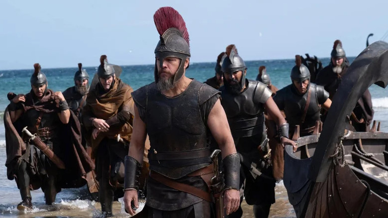

*奥德修斯带领士兵登岛。电影剧照：Universal Pictures，经 [Looper](https://www.looper.com/2218585/christopher-nolan-the-odyssey-jarring-scene/) 发布。*

奥德修斯面对喀耳刻时，单纯挥剑无法解决问题。他必须谈判、理解对方的恐惧，也必须承认自己的队伍并不天然代表文明和正义。

**困境**是过去有效的强硬方式开始失效；**克服方式**是从控制转向交涉；**收获**是他第一次被迫站到“被入侵者”的角度看自己；**反思**是，一个人如果把所有关系都当作战争，就算离开了战场，也永远无法真正回到生活。

## 第四阶段：进入冥界——真正困难的不是看见死亡，而是承认愧疚

在冥界，奥德修斯面对的不再是一个可以杀死或逃开的敌人。那些死去的人重新出现在他面前，他们像是战争和旅途中所有代价的集合。

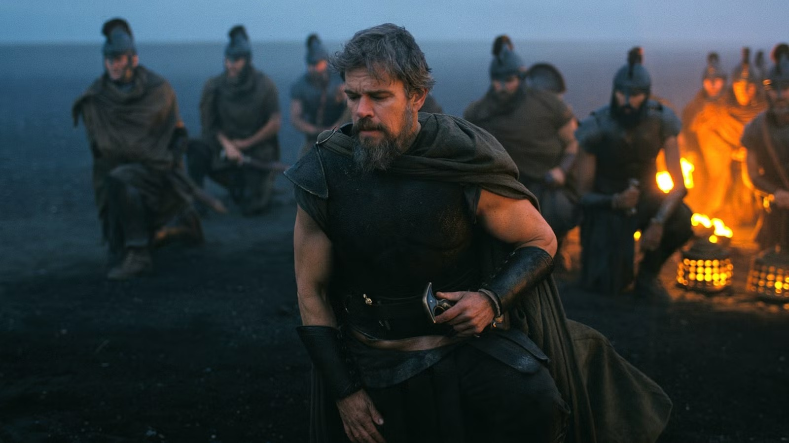

*黑色海岸上的奥德修斯与士兵。电影剧照：Universal Pictures，经 [Looper](https://www.looper.com/2224431/the-odyssey-translator-emily-wilson-christopher-nolan-movie-harsh-words/) 发布。*

这一段的颜色几乎被抽空，只剩黑色土地、灰蓝天空和火焰。此前海洋代表方向的不确定，到了这里，辽阔的空间却像一片无法逃离的内心荒地。奥德修斯身后的士兵还活着，但画面已经让他们看起来像一支等待被历史吞没的亡灵队伍。

这段画面让我感觉，冥界不是某个遥远的神话空间，更像一个人的记忆深处。白天可以靠行动压住的问题，在安静下来以后会重新回来。奥德修斯必须听见死者，也必须承认自己不是每一次都作出了正确选择。

预言给了他回去的方向，却没有替他免除后果。知道接下来会发生什么，不等于能够轻松穿过去。

**困境**是无法改变的过去；**克服方式**不是战胜，而是直面；**收获**是知道归途仍然存在；**反思**是，成熟并不意味着把遗憾解释得合理，而是允许那些无法挽回的事情成为自己的责任感。

## 第五阶段：塞壬——克制不是意志坚定，而是提前约束自己

塞壬的画面把诱惑拍得非常具体。海面与天空看起来平静，危险却来自声音。奥德修斯知道自己无法仅靠意志抵抗，于是让船员堵住耳朵，把自己绑在桅杆上。

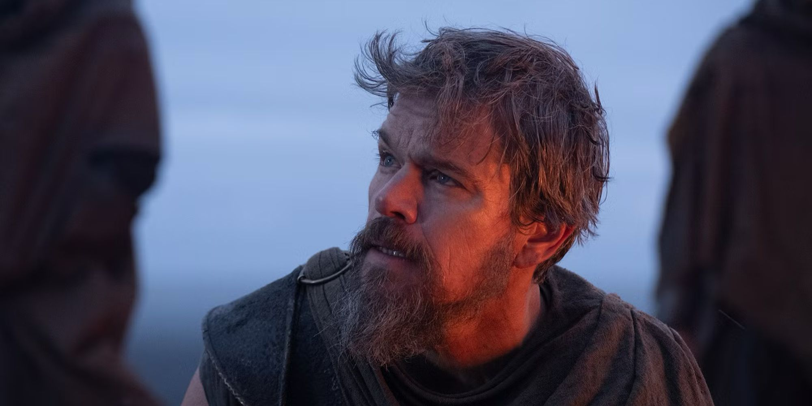

*奥德修斯面对塞壬。电影剧照：Universal Pictures，经 [AOL](https://www.aol.com/articles/christopher-nolan-officially-solved-hardest-213114000.html) 发布。*

这个做法非常像一种现代意义上的自我管理：不要等诱惑出现后再相信临场的自制力，而是在清醒时为未来可能失控的自己设置边界。

**困境**不是不知道危险，而是明知危险仍想靠近；**克服方式**是主动放弃一部分自由；**收获**是他们成功穿过诱惑；**反思**是，真正的克制并不浪漫，它经常意味着承认“我没有自己想象得那么强”。

我们不一定会听到塞壬，却每天都生活在各种提醒、信息、评价和即时满足里。关闭通知、限制使用时间、建立流程，看起来只是小技巧，本质上却和把自己绑在桅杆上一样：用清醒时的决定，保护容易被影响的自己。

## 第六阶段：斯库拉、太阳神的牛与全军覆没——领导者无法逃避取舍

经过斯库拉与卡律布狄斯时，奥德修斯面对的是一个没有完美答案的选择。他知道通过那里会有人牺牲，但另一条路可能让所有人覆灭。于是他继续前进，把少数人的死亡当成保存多数人的代价。

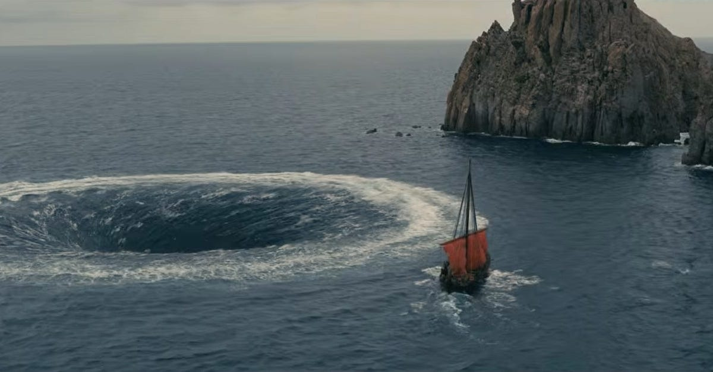

*卡律布狄斯与渺小的船。电影剧照：Universal Pictures，经 [Simon Dillon 的影评](https://simondillon.substack.com/p/film-review-the-odyssey) 发布。*

从远景看，船只是海面上的一个小点。这个构图很准确地表现了这一阶段的处境：奥德修斯依然是船长，却无法命令海洋停止，也无法创造一条不存在的安全路线。领导者的权力在这里不是“我能控制一切”，而是当没有正确答案时，仍然必须选择并承担结果。

这不是一次可以让人振奋的胜利。它更接近领导者最沉重的部分：有时你必须作出决定，而每个答案都会伤害具体的人。电影没有让这种选择停在抽象数字上，那些被带走的人有脸、有声音，也曾经信任他。

随后，在极度饥饿与疲惫中，船员违背警告，宰杀太阳神的牛。对他们来说，那一刻活下去比遥远的禁令更真实；但最后的惩罚让整支队伍覆灭，奥德修斯成为唯一的幸存者。

**困境**从“怎样让所有人回家”变成“还有谁能够回家”；**他的办法**越来越少；**得到的**只剩生存；**失去的**却是全部同伴。这让我想到，幸存并不总是一种胜利。一个人走到最后，也可能必须带着“为什么偏偏是我”的负担继续生活。

## 第七阶段：卡吕普索——最危险的不是困住，而是忘记

电影从卡吕普索的岛屿展开，并通过奥德修斯断裂的回忆慢慢还原过去。与原作不同，电影把莲花与失忆放进了这段关系：卡吕普索给了他安稳、照顾和暂时不必面对过去的生活，他则逐渐忘记自己是谁、从哪里来，也忘记还有人在等他。

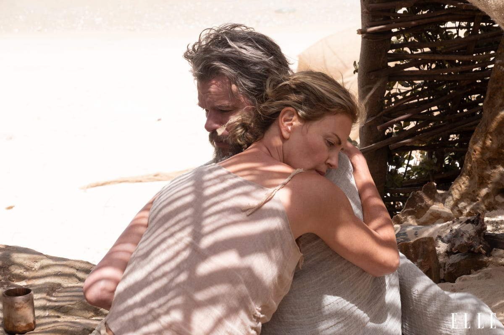

*卡吕普索与奥德修斯。电影剧照：Universal Pictures，经 [ELLE](https://www.elle.com/culture/movies-tv/a71374721/the-odyssey-zendaya-anne-hathaway-lupita-nyongo-charlize-theron-photos-exclusive-2026/) 发布。*

这是我觉得电影最值得发散的地方。前面的怪物威胁他的身体，卡吕普索提供的安逸却在消解他的身份。前者让人想逃，后者甚至让人不再想走。

**困境**是痛苦的记忆与舒适的遗忘之间的选择；**克服方式**是重新讲述过去、拼回身份；**收获**是他终于记起伊萨卡、妻子和孩子；**反思**是，疗愈不应该等同于忘记。真正走出创伤，不是把过去删掉，而是能够带着它继续生活。

诱惑并不总是在劝一个人做坏事。它有时只是给出一种不用再负责的生活。可如果代价是忘记自己珍惜过谁、答应过什么，那么安逸也会变成另一种牢笼。

> 真正的成熟，或许不是终于可以去任何地方，而是经历过远方之后，仍然记得自己为什么要回来。

## 第八阶段：重返伊萨卡——英雄能否不把战争带回家

《奥德赛》的核心词是 *nostos*，意为“归乡”或“回归”。有意思的是，英文里的 *nostalgia* 也来自“归乡”和“痛苦”两个词根。想家并不只是怀念过去，它也包含无法回到原样的痛苦。

回到伊萨卡以后，奥德修斯没有立刻恢复国王身份。他隐藏自己，观察已经陌生的家：求婚者占据宫殿、消耗他的财产，妻子被迫在压力中周旋，儿子则在一个缺少父亲的环境里成长。

弓箭竞赛让他重新证明了身份，随后对求婚者的屠杀却把一个更尖锐的问题摆到面前：一个从战争中归来的人，是否只能继续用战争的方式解决生活？这些求婚者确实越过了边界，但当奥德修斯再次拿起武器时，特洛伊的暴力也跟着他回到了家中。

电影最后让奥德修斯与珀涅罗珀一同离开伊萨卡，走向流亡。这与原作的处理不同，也让“回归”有了更复杂的意义：他终于见到妻子、儿子和故乡，却不能假装过去二十年从未发生。他回到了家，但必须为带回来的暴力继续付出代价。

**困境**是如何夺回已经失去的生活；**克服方式**是智慧、耐心与最后的武力；**收获**是与家人重新相认；**代价**则是无法安稳地留在原地。

但归来本来就不等于退回从前。战争和漂泊改变了奥德修斯，珀涅罗珀也不是被动等待的女人，忒勒马科斯更不再是那个需要父亲保护的孩子。真正的回归，是几个已经改变的人重新认识彼此，再决定是否愿意共同面对下一段路。

## 留在家里的人，也有自己的奥德赛

如果只跟着奥德修斯的船走，很容易把珀涅罗珀和忒勒马科斯理解成“等待英雄回来的人”。但电影不断切回伊萨卡，让我意识到：远行的人面对怪物，留下的人面对的是时间。

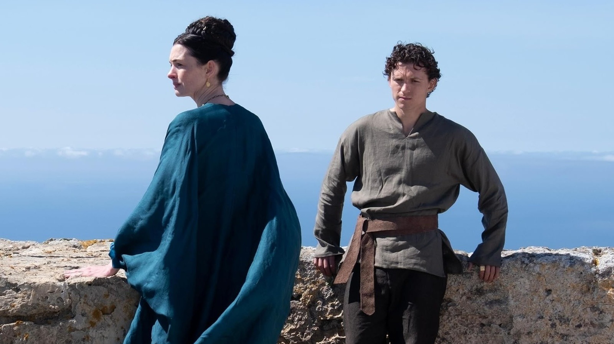

*珀涅罗珀与忒勒马科斯。电影剧照：Universal Pictures，经 [AOL](https://www.aol.com/articles/odyssey-people-sea-explained-004500000.html) 发布。*

珀涅罗珀的等待不是静止。求婚者住进宫殿，消耗王国的资源，也不断迫使她承认丈夫已经死去。她必须周旋、拖延，在没有外部力量保护的情况下守住家庭。她的力量不是挥剑，而是在长期压力下仍然不把决定权交出去。

忒勒马科斯面对的则是另一种困境：所有人都在谈论他的父亲，但他几乎不认识那个真实的人。他继承了英雄之子的身份，却没有得到父亲的陪伴。他必须先从别人讲述的故事里寻找奥德修斯，然后才有机会判断自己要不要成为和父亲一样的人。

这让我觉得，《奥德赛》不只是“一个父亲回家”，也是“一个儿子如何面对父亲的缺席”。男性成长有时并不是从父亲那里学会了什么，而是看清父亲留下的空白后，决定不再重复什么。

珀涅罗珀也提醒我，所谓英雄的代价往往由家人共同承担。一个人可以把远行解释成使命，把冒险写成荣耀，可对留下的人来说，那可能意味着二十年的不确定、生活压力和被迫坚强。评价一个人的成就，不能只看他带回了什么，也要看谁替他守住了身后的生活。

## 奥德修斯讲述旅程，也在重新解释自己

诺兰没有按照时间顺序讲完这段故事。电影从卡吕普索岛上那个失去记忆、只剩疲惫的奥德修斯开始，再让过去以碎片的方式回来。我们看到的许多冒险，并不是一个客观镜头下的完整历史，而是他对别人、也对自己重新讲述的记忆。

这给故事增加了一层很有意思的不确定性：怪物究竟有多可怕？神明是否真的出现？奥德修斯有没有在叙述中放大无法控制的命运，从而减轻自己应承担的责任？电影没有把所有答案说死。

人也经常这样理解自己。我们会把成功整理成能力，把失败解释成环境，把无法面对的选择包装成“当时没有办法”。叙述可以帮助一个人走出创伤，也可能成为逃避责任的方式。

奥德修斯真正的成长，不只是记起发生过什么，而是逐渐停止把一切归因于怪物、神明和命运。他必须承认，有些灾难来自自己的骄傲，有些牺牲来自自己的判断，有些人没有回来，而他参与制造了这个结果。

所以“认识自己”并不只是知道自己的优点和方向，还包括能够讲述一个不完全有利于自己的版本。一个人什么时候开始成熟？也许就是他不再急着证明“我没有错”，而是开始问“我在其中承担什么”。

## 幸存不是胜利，而是一份需要回应的责任

奥德修斯最终独自活下来。传统英雄叙事很容易把这理解成命运对强者的选择，但电影里的他越接近家，身上越不像一个胜利者。

幸存者真正难以回答的问题是：为什么其他人死了，而我还活着？如果把答案简单归结为自己更聪明、更坚强，就会抹去运气、他人的牺牲，以及自己曾经作错的决定。可如果一直被愧疚淹没，又无法继续生活。

成熟可能就在这两者之间：既不把幸存包装成个人神话，也不让负罪感成为另一种自我中心。活下来的人能做的，是让那些失去真正改变自己——以后更谨慎地使用权力，更诚实地面对代价，也更珍惜仍然存在的关系。

这也是为什么奥德修斯最后的流亡让我印象深刻。电影没有用“回家”替他取消责任。归途完成了，清算却没有结束。他获得的不是从此幸福生活的奖励，而是一次带着全部记忆重新开始的机会。

> 走过苦难并不会自动让人成熟。只有当一个人允许苦难改变自己的选择，它才真正成为成长。

## 为什么我会想到《西游记》

看电影时，我也不断想到东方神话，尤其是《西游记》。这只是我的直观阅读感受，并不是要给两种文化下一个绝对结论。

把两幅传统图像放在一起看，这种差异会变得更直观。

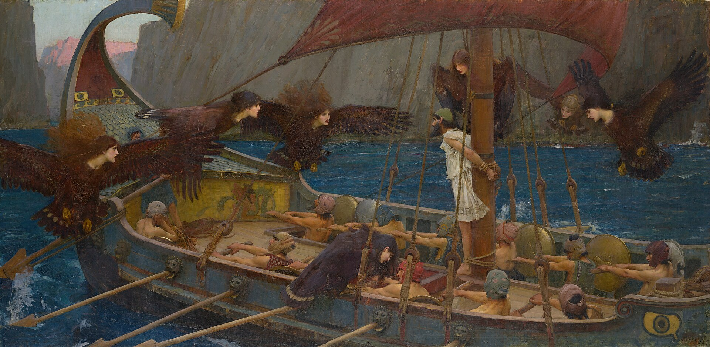

*约翰·威廉·沃特豪斯《尤利西斯与塞壬》，1891 年，现藏于澳大利亚维多利亚国家美术馆。公共领域图像，来源：[Wikimedia Commons](https://commons.wikimedia.org/wiki/File:John_William_Waterhouse_-_Ulysses_and_the_Sirens_-_Google_Art_Project.jpg)。*

在沃特豪斯的画里，奥德修斯被固定在画面中央。他的身体不能移动，真正发生的冲突却在内部：一边是想要听见塞壬歌声的欲望，一边是自己事先设下的约束。船员就在身边，却无法替他完成这场抵抗。这个英雄时刻不是向外击败敌人，而是防止自己成为欲望的俘虏。

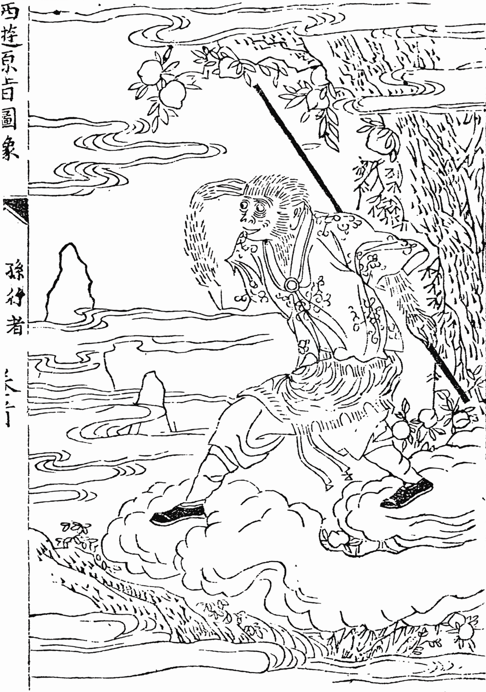

*古本《西游记》中的孙悟空，约 15 世纪，作者不详。公共领域图像，来源：[Wikimedia Commons](https://commons.wikimedia.org/wiki/File:Xiyou.PNG)。*

《西游记》的古版插图则充满向外运动的感觉。孙悟空站在云上、手持金箍棒，身体和视线都指向下一处未知的空间。山水、云气和果树共同构成了一个还可以继续展开的世界。画面最先让人感受到的是“接下来还会遇见什么”。

当然，两张画不能代表全部东西方文化。但它们恰好呼应了我的阅读印象：《奥德赛》经常把外部怪物转化为人的内部考验，《西游记》则擅长把人的性格放进不断变化的外部世界，通过一难又一难让人物彼此磨合。

《西游记》当然也在讲成长。孙悟空从大闹天宫时的桀骜不驯，到取经途中逐渐学会克制、合作和承担责任，本身就是非常明显的变化。唐僧、猪八戒和沙僧也各自带着弱点前进。

但在我的阅读记忆里，《西游记》最吸引人的首先是一个接一个的奇遇：不同的妖怪、法术、骗局和解法，以及师徒四人的关系。它更像是一群性格不同的人，如何在共同目标下完成一段旅程。成长藏在一次次磨合里。

《奥德赛》给我的感受则更集中在个人内部：一个男人如何面对荣耀与虚荣，如何抵抗让自己忘记归途的诱惑，如何重新理解妻子、孩子和家庭。它把“成为英雄”与“成为丈夫、父亲和一个能够承担后果的人”放在了一起。

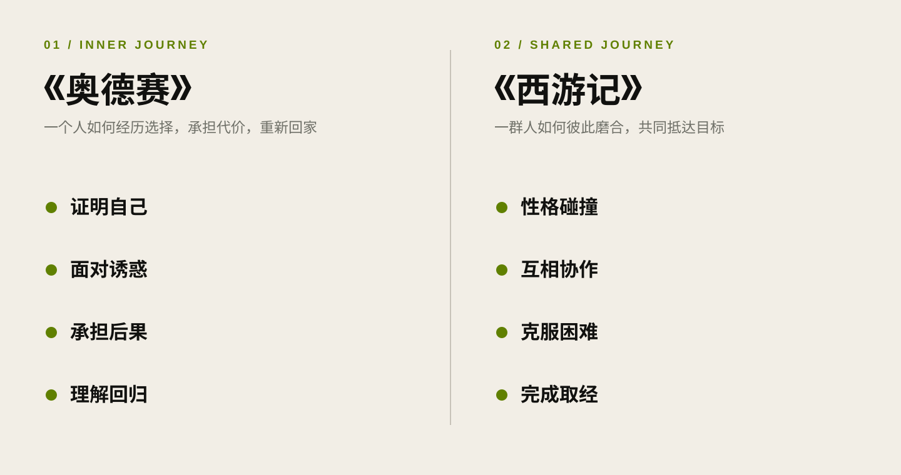

*这不是文化高下的判断，而是我在两部作品中感受到的叙事重心。*

两种故事并不是一边有成长、一边没有成长，而是把镜头放在了不同的位置：《西游记》让我看见同行、磨合和共同目标，《奥德赛》让我看见选择、代价与回归。一个人的成长既需要内部的自省，也需要在关系中不断调整自己。

## 男性成长，不只是变得更强

这部电影让我重新思考“男性成长”这个说法。

我们经常把男性的成熟和更强的能力联系起来：可以解决问题，可以保护别人，可以独自面对世界。但如果只有力量，没有克制；只有胜利，没有对后果的承担；只有远方，没有值得回去的关系，那么这种强大依然是不完整的。

奥德修斯的故事真正打动我的，是它让一个传统英雄最终面对非常日常的命题：如何做一个丈夫，如何做一个父亲，如何回到生活，如何修复自己长久缺席留下的空白。

从追求自由，到理解边界；从证明自己，到承担后果；从渴望被所有人看见，到知道应该守护哪些具体的人——这或许才是成熟更难的部分。

## 写在最后

神话把成长变成了海洋、风暴、怪物和十年的漂泊。现实中的我们不会经历同样的旅程，但会遇到自己的诱惑、迷失和选择。

有些人一直在出发，却没有想过要去哪里；有些人拥有了更多能力，却没有学会如何承担；还有些人在追逐远方的过程中，逐渐忘记了最初为何出发。

看完《奥德赛》，我更愿意把成熟理解为一种清醒：知道自己能做什么，也知道什么不应该做；知道外面的世界很大，也知道哪些关系不能失去；在走过足够远的路以后，仍能找到回去的方向。

远方证明一个人有能力离开，归来则证明他终于理解了自己。

---

**资料说明**：电影主创、演员及制作信息参考 [Universal Pictures 官方介绍](https://universalpictures.ca/movie/the-odyssey/)；电影情节及其与原作的差异交叉参考 [AP 影评](https://apnews.com/article/fceb80683c5ecdc627f8e9221b833ca0)、[RogerEbert.com 影评](https://www.rogerebert.com/reviews/the-odyssey-christopher-nolan-matt-damon-film-review-2026)、[TheWrap 结局解析](https://www.thewrap.com/creative-content/movies/the-odyssey-ending-explained/) 与 [Entertainment Weekly 的官方剧照报道](https://ew.com/the-odyssey-exclusive-images-matt-damon-anne-hathaway-tom-holland-11857321)；关于 *nostos* 与归乡主题的解释参考 [The Open University 的《奥德赛》公开课程](https://www.open.edu/openlearn/history-the-arts/exploring-homers-odyssey/content-section-6)。正文中的现实联想与价值判断均为个人观影后的理解。
