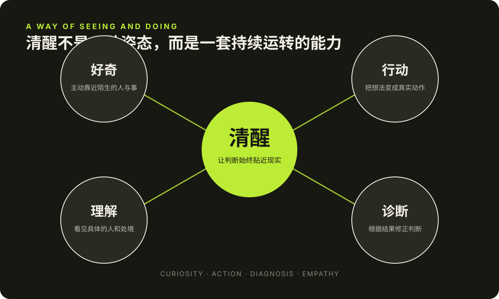
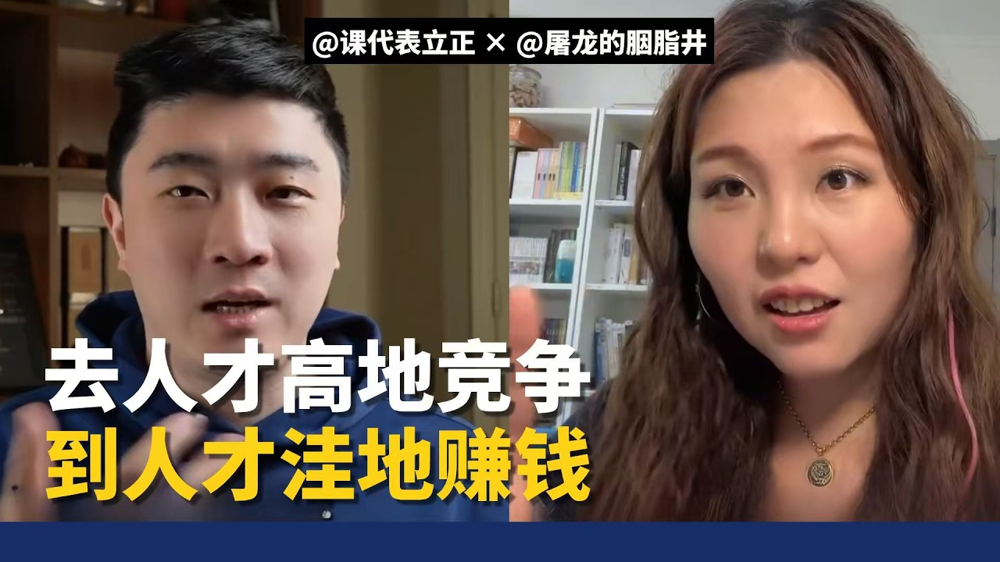
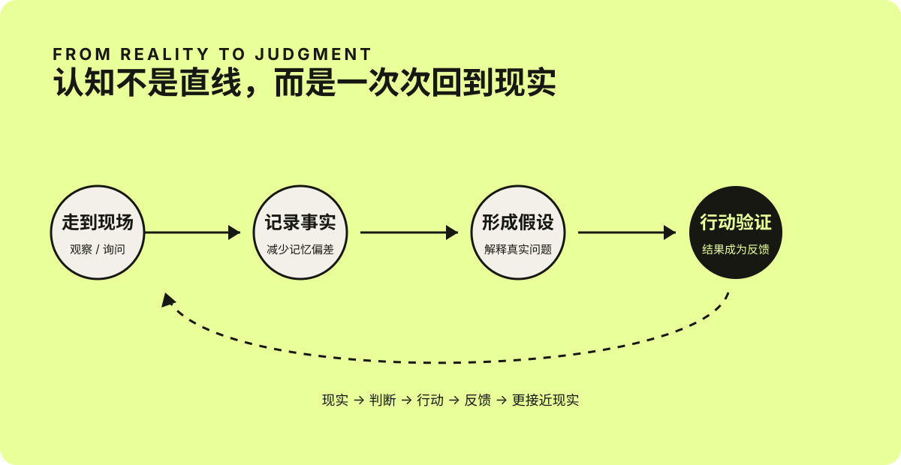

# 屠龙的清醒：先下场，再把事情想明白

今天看了「课代表立正」对屠龙博士杨滢的访谈。一个半小时聊了创业、内容、产品、团队和人与人之间的关系，信息很多，但看完后留在我脑子里的并不是某条可以直接照搬的商业技巧，而是一种很鲜明的做事方式：**走进现实，获得一手信息；开始行动，再通过结果修正判断。**

我很喜欢这个采访，也认同其中的不少观点。因为它没有把成功解释成一个漂亮的公式。相反，屠龙博士讲的大多是具体现场：卖不出去的首饰、突然增长的粉丝、没有下单的购物车、被盗的仓库、复杂的供应链，以及那些与你立场不同、却仍然值得理解的人。

## 我喜欢她身上的那股劲儿

屠龙给我的第一印象是聪明，但看完整场访谈后，我觉得她真正吸引人的地方并不只是聪明。

她有很强的好奇心。看到宾夕法尼亚乡村里不同寻常的竞选牌，她不会只在心里猜测，而是停下来和当地人聊天；进入一个陌生行业，她也不会因为自己过去的学历和经历而端着，而是愿意重新学习销售、渠道和供应链。

她还有一种少见的行动力。很多人也能发现问题、提出假设，但往往停在分析阶段。她会把判断变成一个动作，再让真实结果告诉自己想得对不对。**她不是等到完全想清楚以后才行动，而是在行动中把事情想清楚。**

她说话直接，甚至有时带着锋利感，但这种直接背后并不是对人的轻视。访谈越到后面越能看见，她愿意理解盗版书背后的阅读困境、网红背后的生存压力，也愿意承认自己过去没有看到事情的另一面。**真正让人信服的，不是“我一直是对的”，而是“我愿意因为看见了新的事实而改变”。**

我觉得这种清醒、坦率、能做事，又仍然保留理解他人能力的组合，构成了她非常独特的个人魅力。

*我从访谈中感受到的四种特质：好奇让她靠近现实，行动带来反馈，诊断修正判断，理解让直接不至于变成傲慢。*

*视频：《一红16年，干啥啥赚钱？｜屠龙博士创业的秘密！》，来源：[课代表立正 YouTube 频道](https://www.youtube.com/watch?v=vd_oYgwQSBM)。点击图片可观看原视频。*

## 一手信息，比精致的推演更接近现实

访谈开头有一段很有代表性的经历。

2016 年，屠龙博士还在美国做博士后。因为需要从匹兹堡开车去华盛顿汇报项目，她回程时常常绕进宾夕法尼亚州的乡村，去当地的小餐馆吃饭，并主动和遇到的人聊天。她发现，许多村镇里到处是特朗普的竞选牌，支持希拉里的人却很少。

当时主流预测给出了另一种判断，但她更相信自己一路记录下来的观察。这些信息也参与了她后来是否回国的决定。

这段经历让我印象很深。她的优势并不只是“判断准”，而是完成了几个很朴素、也很少有人真的去做的动作：走出熟悉的圈子，和陌生人交谈，把感受变成记录，再把记录放进自己的决策里。

我们常常以为认知来自阅读更多报告、关注更多观点、掌握更多概念。但二手信息经过筛选、概括和传播后，总会失去一部分真实的纹理。数据告诉我们“发生了什么”，现场才会让人看见“它为什么会发生”。

这并不是说个人观察一定比统计数据可靠，而是提醒我：**重要的判断，不能只建立在别人的转述之上，还要给自己一个与现实相互校准的机会。**

*我根据这次访谈整理的认知循环。*

## 不要只学习名词，要学习动词

整场访谈里，我最喜欢的一句话，是“大家学习的时候关注的是名词，真正应该学的是动词”。

名词很容易给人一种已经掌握的感觉。我们知道品牌、流量、用户、供应链、组织管理，也可以复述复利、增长和长期主义。但当这些词真正变成“卖一次商品”“招一个人”“处理一次投诉”“分析一次没有转化的订单”，事情会立刻变得具体而混乱。

屠龙博士讲到，创业后才会遇见仓库失窃、用户信息泄露、渠道灰产等问题。仅仅知道“供应链”这个名词，并不会自动知道怎样在这些现场里作出判断。只有真正做过，知识才会从一句定义变成身体里积累的经验。

这也解释了为什么许多看起来正确的方法，执行后却没有效果。问题未必在方法本身，而可能在我们跳过了中间所有细小的动词：**观察、询问、尝试、记录、诊断、调整，然后再做一次。**

对我来说，这个观点也适用于工作和生活。学习一件事，不是不断收藏与它有关的概念，而是尽快找到一个能落到现实里的动作。想学习写作，就写完一篇文章；想理解用户，就真的和用户谈一次；想改善工作方式，就改变一个流程，再看结果有没有不同。

## 长期主义，不是重复，而是持续诊断

屠龙博士从 2010 年开始写微博。她把内容增长描述成一条很长时间近乎平坦、后来才突然向上的曲线。这个“拐点”很容易被事后归因于某个爆款或一次机会，但她更倾向于把它看成多个条件分别积累、最终一起越过临界值的结果。

这个解释比“坚持就会成功”更诚实。

坚持本身并不保证结果。如果每天都用同一种方式重复错误，时间只会放大错误。**真正有效的长期主义，是方向不轻易改变，但每天都在诊断。**这次新增的人从哪里来？为什么有人把商品放进购物车却没有购买？哪些渠道可以扩大，哪些已经走到尽头？一个小改动能不能形成新的反馈？

因此，长期主义包含两种看似矛盾的能力：一方面，不因为短期没有回报就放弃；另一方面，也不把“坚持”当成拒绝改变的理由。

> 守住的是长期方向，反复改变的是抵达它的方法。

访谈里有一个细节很有意思：她认为，如果一开始就轻易成功，可能不是自己特别厉害，而是目标定得太低。失败因此不只是挫折，也是一次诊断机会。它暴露了原先没有看见的变量，让人有机会对现实多理解一点。

## 独特性，不是设计出来的人设

屠龙博士做书店时，书卖得很好，首饰却几乎卖不动。同样的流量面对不同产品，产生了完全不同的结果。她由此得到的判断是：用户购买的并不是“博主推荐的一切”，而是他们真正信任这个人、也认为这个人有判断力的那一部分。

这让我重新理解“个人品牌”。**它不是先选一个标签，再努力把自己塞进标签里。**它也不是观察所有竞争者后，把他们有效的部分拼在一起。这样做出来的人设也许完整，却很容易失去辨识度。

她在访谈中反复提到不要过度看竞对。因为当一个人总在补齐别人有、自己没有的部分时，最终会越来越平衡，也越来越像所有人。真正能够持续很久的内容，往往来自一个人长期经历、阅读和思考后形成的独特视角。

这对我更新 Blog 也很有启发。写作不需要把自己严格定义成某一类博主。工作、AI、生活和阅读看起来分散，但它们都来自同一个人的观察。如果为了追求“垂直”而删掉那些不够统一的部分，可能也会删掉最真实、最难被复制的东西。

## 先做销售，再做产品

访谈里还有一个很具体的创业判断：在做产品之前，先学习销售。

这里的“销售”并不只是说服别人购买，而是验证自己有没有真正理解需求。一个人可以花很长时间打磨心目中的好产品，但如果从未面对真实用户，就很可能只是在解决一个想象中的问题。

屠龙博士先从书店做起，是因为卖别人的产品可以更快地理解渠道、品类和消费者。书店后来成功，不只因为她有流量，还因为“读过很多书、能够说清一本书为什么有用”正好是用户信任她的地方。同时，图书毛利低，也必须和渠道成本一起考虑。流量、人设、品类、价格与渠道不是几个彼此独立的词，而是一组互相制约的关系。

这段内容给我的启发并不是“创业应该先开店”，而是更普遍的一点：**在投入大量成本之前，先让自己的假设接受一次真实交换的检验。** 用户愿不愿意付出时间、注意力或金钱，比口头上的认可更接近答案。

## 成熟不是变圆滑，而是提高修养

如果文章停在这里，这期访谈可能只是一组有效的做事方法。但最后关于“直率与情商”的讨论，让整场对话多了一层更深的东西。

屠龙博士说，一个人不必为了适应社会而改变自己的性格，真正要提升的是修养。她区分了两件经常被混在一起的事：**说话绕弯、避免冲突，是表达方式；尊重他人、理解他人的处境，才是思想的底层。**

有些人语言非常客气，内心却并不尊重对方；有些人表达直接，却愿意认真理解一个与自己利益冲突的人。圆滑不必然等于善意，直率也不必然等于真诚。关键是，当冲突发生时，能否停下来问：对方的观点有没有合理之处？他的处境里，有没有我没有看见的困难？

访谈里谈到盗版书时，这种变化尤其明显。她最初只看见盗版对正版和产品安全的伤害，后来从丈夫的经历中意识到，一些廉价的盗版书也可能是偏远地区孩子少数能够接触到的读物。理解这一面，并不意味着认同盗版，而是承认现实问题很少只有一个平整的切面。

我很认同这种反思方式：不是因为别人不喜欢自己的表达，就让自己以后不再说话；也不是把“我性格直”当成拒绝改变的挡箭牌。应该检查的，是自己的理解是否足够完整，是否忽略了具体的人。思想更准确以后，表达自然会发生变化。

## 我从这场访谈里留下的四件事

一个半小时的对话很难压缩成几条结论。如果一定要留下几件可以带走的东西，我会记住这四点：

1. **重要的判断，尽量补上一手信息。** 不要只在相似的人和熟悉的观点之间循环。
2. **把名词改写成动词。** 与其继续研究“写作”，不如写完、发布，再观察真实反馈。
3. **用诊断代替自我评价。** 结果不好时，先分析哪里出了问题，而不是急着证明自己不行或方法无效。
4. **保留个性，增加理解。** 不必把自己改造成圆滑的人，但要不断扩大自己能够看见和尊重的处境。

回头看，这些内容其实都指向同一件事：**不要把头脑中的模型误认为现实本身。** 去现场，去行动，去面对结果，也去理解那些与你不同的人。认知不是在某个时刻突然获得的答案，而是在一次次接触现实后，逐渐修正出来的能力。

这可能也是我如此喜欢这期访谈的原因。它讲了很多方法，却没有让方法显得轻巧；它谈成功，却保留了失败、混乱和人的复杂。真正有用的经验，往往不是告诉我们世界应该怎样运行，而是提醒我们：世界实际怎样运行，需要自己下场去看。

---

延伸观看：[《一红16年，干啥啥赚钱？｜屠龙博士创业的秘密！》](https://www.youtube.com/watch?v=vd_oYgwQSBM)，课代表立正，2026 年 6 月 25 日。
